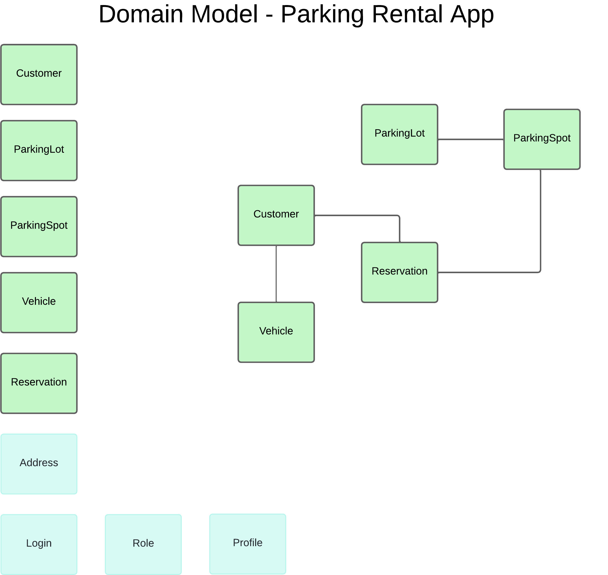
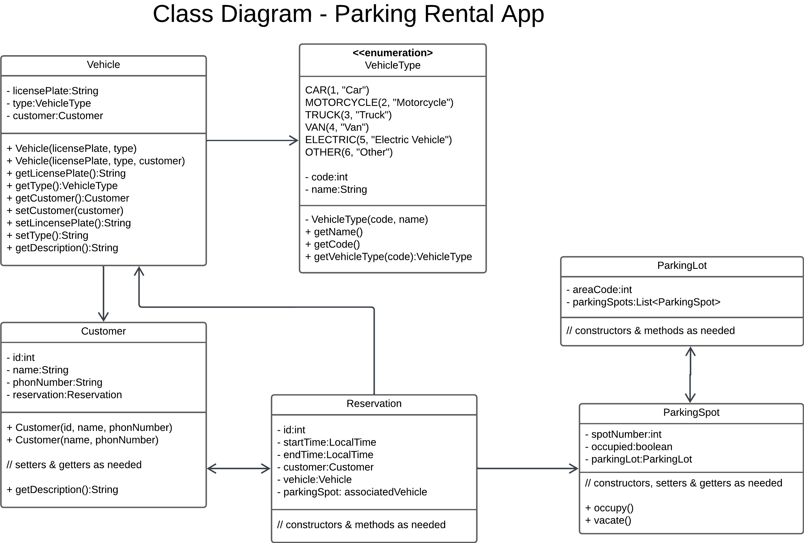
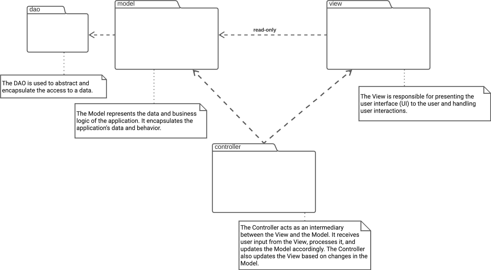

# Parking Rental App

## Scenario
> Imagine you're tasked with creating a parking rental application to streamline parking management.    
> In this system, customers reserve parking spots, each with unique details like their name and phone number etc.  
> These reservations are linked to specific parking spaces, which can either be occupied or vacant.  
> Customers have the option to associate a vehicle with their reservation by providing its license plate and type,  
> such as car or motorcycle etc. The parking lot, identified by an area code, consists of multiple parking spaces.  
> This application facilitates efficient organization and management of parking reservations, ensuring a seamless  
> experience for both customers and parking operators.

### Task 1:
#### Your task is to design a class diagram that includes the necessary objects mentioned in the scenario.

### Hints:
- **Think like a mapmaker.**
- **Model the real-world entities.**
- **Use existing words.**
- **Do not include too much information.**
- **Align with the provided requirements.**
- **Do not add things that don’t exist.**

# Parking Rental App Domain Model & Class Diagram

## ParkingLot
- Represents a parking area that contains multiple parking spots.
- **Attributes**:
    - `areaCode: int` - The unique identifier for the parking lot.
- **Associations**:
    - **Composition with ParkingSpot**: Aggregates multiple parking spots.

## ParkingSpot
- Represents an individual parking spot within a parking lot.
- **Attributes**:
    - `spotNumber: int` - The identifier for the parking spot.
    - `isOccupied: boolean` - Indicates whether the spot is occupied.
- **Associations**:
    - **Belongs to ParkingLot**: Each parking spot is part of a specific parking lot.
    - **Composition with Reservation**: A parking spot can be associated with reservations.

## Customer
- Represents a customer who can reserve parking spots.
- **Attributes**:
    - `id: int` - The unique identifier for the customer.
    - `name: String` - The customer's name.
    - `phoneNumber: String` - The customer's phone number.
- **Associations**:
    - **Composition with Reservation**: Each customer can have multiple reservations.

## Vehicle
- Represents a vehicle that can be associated with a customer's reservation.
- **Attributes**:
    - `licensePlate: String` - The license plate of the vehicle.
    - `type: VehicleType` - The type of the vehicle (e.g., car, motorcycle).
- **Associations**:
    - **Composition with Reservation**: A vehicle can be associated with reservations.

## Reservation
- Represents a reservation made by a customer for a parking spot.
- **Attributes**:
    - `id: String` - The unique identifier for the reservation.
    - `startTime: LocalTime` - The start time of the reservation.
    - `endTime: LocalTime` - The end time of the reservation.
- **Associations**:
    - **Belongs to ParkingSpot**: Each reservation is associated with a specific parking spot.
    - **Belongs to Vehicle**: Each reservation is associated with a specific vehicle.

## Domain Model vs Class Diagram
### Domain Model
- Focus: It focuses on the entities (objects or concepts) with their attributes and relationships.
- Details: It provides an abstraction of the domain, describing the key concepts, their properties, and how they relate to each other.
- Purpose: It helps in understanding the problem domain, defining the scope of the software system, and guiding the software design process by providing a common understanding of the domain.

### Class Diagram
- Focus: It mainly focuses on the classes, their attributes, methods, and the relationships between classes.
- Details: It provides details about the structure of the software system, including classes, interfaces, associations, inheritance, and dependencies.
- Purpose: It helps in visualizing the structure of the system, understanding the relationships between classes, and designing the software architecture.

## Domain Model

## Class diagram

## MVC

